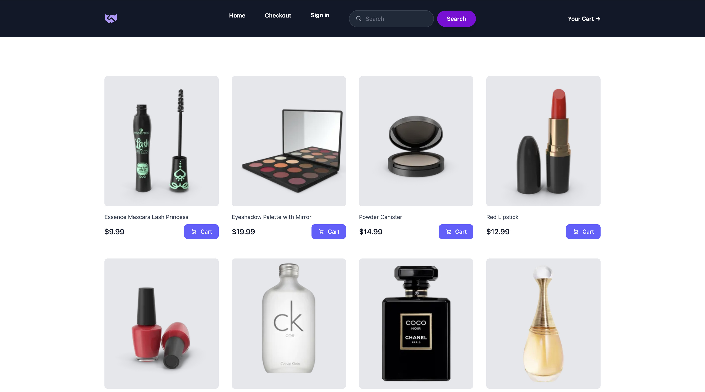
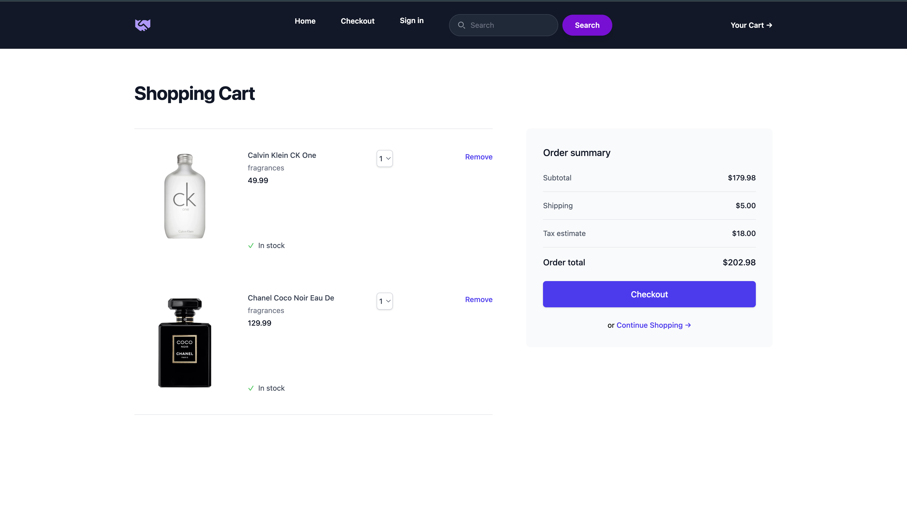
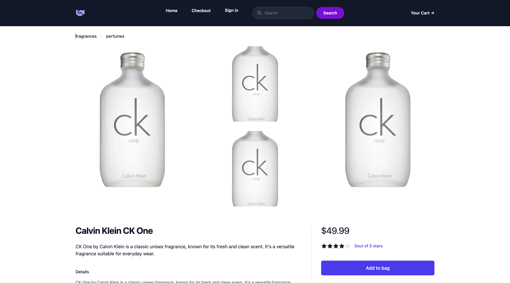

# 🛒 React E-Commerce Store

A modern, responsive e-commerce web application built using **React**, **Redux Toolkit**, and **Tailwind CSS**.  
This project demonstrates scalable state management, dynamic routing, and real-world cart and checkout logic.

---





## 🚀 Features

- Dynamic product fetching from the **DummyJSON API**
- Global state management using **Redux Toolkit**
- Product detail pages with dynamic routing
- Fully functional shopping cart
- Real-time order calculations
- Responsive UI for mobile and desktop devices

---

## 🧰 Tech Stack

- **React.js**
- **Redux Toolkit**
- **React Router DOM**
- **Axios**
- **Tailwind CSS**
- **Headless UI**
- **Heroicons**

---

## ✨ Core Functionality

### Product Management
- Products are fetched dynamically using Axios
- Product data is stored globally in Redux
- Enables reuse across search, product detail, and checkout components

### Shopping Cart
- Add items to cart
- Remove individual items
- Clear entire cart
- Cart state is centralized and reactive

### Checkout Logic
- **Subtotal:** Sum of all cart items
- **Tax:** 10% of subtotal
- **Shipping:** Flat $5 fee (applied only when cart is not empty)

---


---

## 🧠 Architecture Overview

### Redux Store
- **productSlice**  
  Stores all fetched products for global access.

- **cartSlice**  
  Manages cart items with reducers for adding, removing, and clearing items.

- **appStore**  
  Combines product and cart reducers into a single centralized store.

### Data Flow
1. Products are fetched in `Body.jsx`
2. Data is dispatched to Redux using `setProduct`
3. Components consume data via selectors
4. Cart updates trigger automatic recalculations

---

## ⚙️ Installation & Setup

```bash
# Clone the repository
git clone <your-repo-url>

# Install dependencies
npm install

# Start the development server
npm run dev
